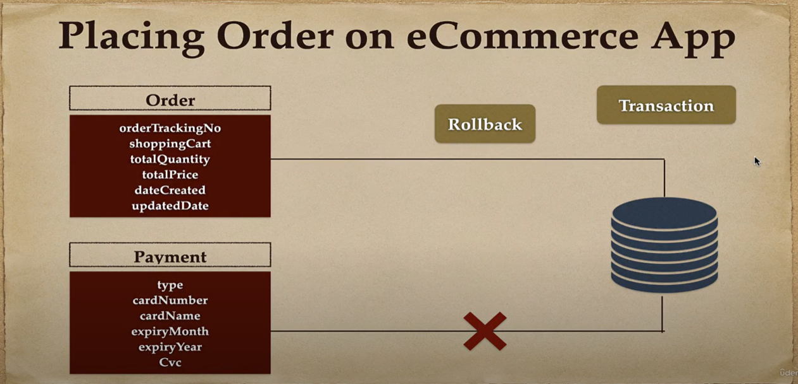

# Getting Started

## Transaction Management with Spring Boot and Spring Data JPA (@Transaction Annotation)
How Spring Data JPA provides a default transaction management

Create Spring boot project step by step and implement Transaction Management using @Transactional (We will take eCommerce place order use case)

## Transaction Management with Spring Data JAP
* JpaRepository
* SimpleJpaRepositor

## Placing Order on eCommerce App
